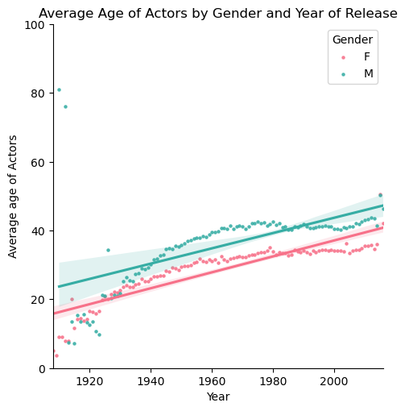

  <strong>Into the Male Gaze </strong> 

  <strong>A Story of Representation in Cinema </strong> 

 
 

### About CMU Movie Summary Corpus
All data comes from the CMU Movie Summary Corpus Datasets. CMU Movie Summary is an open corupus containing 42,306 movie plot summaries extracted from wikipedia, as well as metadeta from Freebase including revenues, genres, release dates, runtimes, languages, character names, and actor information. It was compiled by the Language Technologies Institute and Machine Learning Department at Carnegie Mellon University. Movie data ranges from 1888 to 2016. The CMU Corpus is publically available [here](http://www.cs.cmu.edu/~ark/personas/).
 
 

### Framing our Research

Art imitates life and life imitates art - Cinema has the power to capture the zeitgeist of an era. In this project we will be studying gender representation in cinema to better understand trends in societal sentiments. Our goal is to assess if representations differ by gender and if they have evolved through time. This project is motivated by the fact that the 20th century was a time of dynamic social upheavel and mobility, e.g., in Switzerland, womens sufferage at the federal level was granted as late as 1971.

Culture and Cinema share a dynamic intertwined relationship. Cinema reflects the values and patterns of the culture which produced it while simultaneoulsy shaping and influencing the culture itself. In this manner, cinema and culture display a feedback loop of influence. This project is predicated on the idea that character portrayal in cinema serves as a mirror for society, which gave rise to the character.  Character focused analysis will lean heavily on Stanford NLP library in order to understand lexical groups by which characters are represented.
 
 

### Cinema's Increasing Impact
Since its conception in the late 19th century, The cinema industry's relevance and impact has continued to grow. In America alone, three in four people reported going to the cinema just last year... Cinema today has grown into a major global industry - with a market size in the hundred billions USD. People flock to theatres and now increasingly streaming services as venues to consume the latest releases. It has become increasingly common not only as amusement, but also to promote social and political agendas. As the industry grows, the dynamic interplay between cinema and culture continues to reinforce itself, and is likely to only increase in the future. 

 

<table>
  <tr>
    <td> <i>Fig.1: Movie releases by year </i> </td>
     <td> <i>Fig.2: Average revenue by year </i> </td>
  </tr>
  <tr>
    <td></td>
    <td></td>
  </tr>
 </table>
 
From preliminary exploration of our data, it is immediately evident that the cinema industry is a growing one. In _Figure 1_ we see the meteoric rise in raw amount of movies being released over the last century. The sharp drop off in the 2010's is simply due to an end to the data collection, and does not reflect a real decrease in movie releases. _Figure 2_ shows the mean revenue of these movies over the same timeframe. Bubble sizes reflect the amount of movies being used in the averaging calculation - spanning two orders of magnitude (1 to 100's). When paired together we get a clear indicator of the increasing market size and depth over time.

### What are we looking for? Research questions
The following questions do not comprise an exhaustive list, but are fundamental to study gender representation in movies. They serve to scope, inspire, and guide the analysis.

* What is the prevalence of m/f characters?
* Is there a discrepency in age between m/f characters? 
* How can we differentiate between depictions of male and female characters?
    + How do they act? How do others act unto them?
    + How are they described?
* Can we extract archetypes / stereotypes across genders through lexical analysis?
* Do the aforementioned questions show an evolution over time? Do they show discernable differences across geographies?

### Initial findings of data exploration. 

We will begin with a few preliminary explorations of our data. There has been a longstanding imbalance in the film industry, with men occupying a larger fraction of representation on screen, often in more distinguished roles. This leads to a simultaneous marginalization and perpetuation of stereotypes via the portrayal of women. 
    
<table align = 'center' >
  <tr>
    <td> <i>Fig.3: Disparity in Age by Gender </i> </td>
  </tr>
  <tr>
    <td></td>
  </tr>
 </table>
 
 
 

In _Figure 3_ above we are displaying the average age at movie release for female and male actors, as well as a linear regression of the average age evolving over time. The shaded areas represent the 95% confidence interval for the regression. We see that there is indeed a difference between the average age of actors and actresses, where actors are on average older than actresses.  
There is also an apparent trend of increasing age, both for actresses and actors. It is unlikely that this is actually the case, but rather there is little age data for older actors at the beginning of the 20th century. Record keeping was not as good as it is now. The younger actors, whome we do have data on, are disproportionately represented in these early years- ie they lived long and late enough in the century to enter modern databases.
 
This reflects a common cinema trope in which women are portrayed by actresses far younger than their male counterparts, even if they're supposed to be relatively the same age. This trope can reinforce and perpetuate the notion that youth and beauty are of qualities of paramount importance for women, and of less importance for male counterparts. This theme is concurrent with the idea that women have a limited 'shelf life' and are less valuble as actresses as they age. Now that we have confirmed there is indeed some surface level imbalances in representation, we will continue to explore further.
    
 
 
 

### Data Analysis
* NLP: Agent, Patient, Attributes
    + Lexical analysis: we can compare the raw output of NLP output. See the more significant differences between gender in patient, agent and attributes
    + PCA: More precise analysis which considers only the most important categories which exhibit the most significant differences between the genders
    + Sentiment Analysis with empath
    + FURTHER ANALYSIS TO COME
    
### Conclusion on the results

